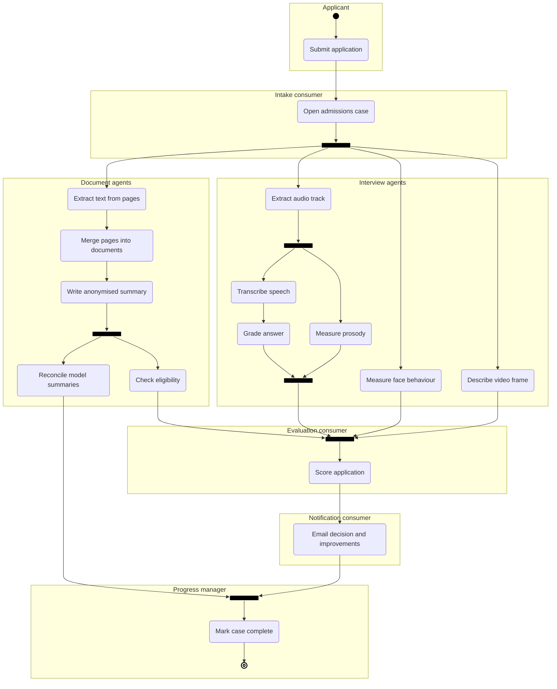
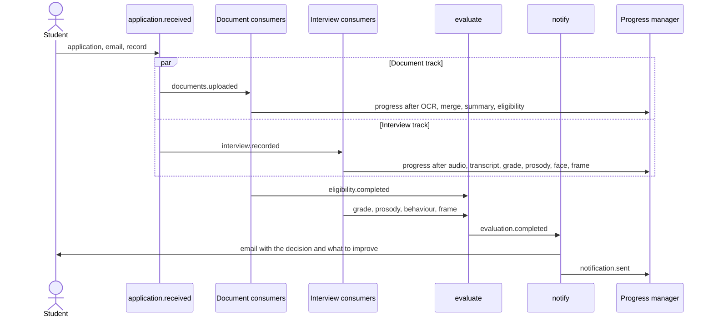
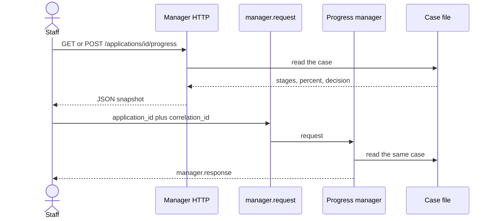
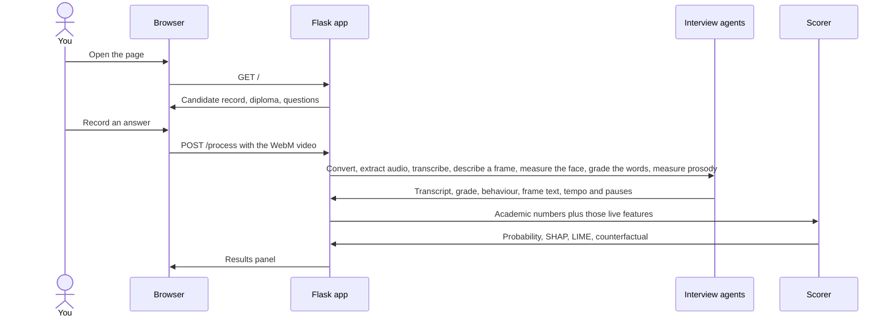
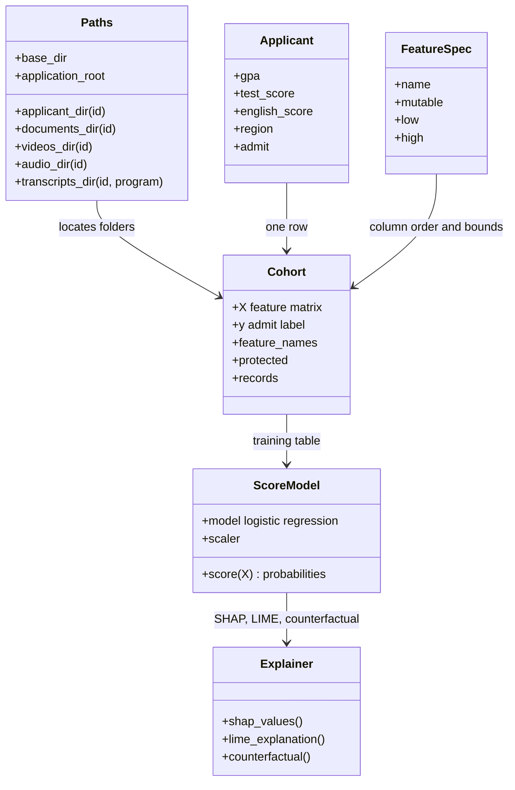

# How FAIR-VID is built

FAIR-VID is a **digital twin** of a university admissions desk. A digital twin
is a software copy of a real process. Here the process is: a person applies,
staff read their documents, staff watch an interview, then someone decides
whether to admit them.

The copy is split into small **agents**. Each agent is one program with one
Kafka topic. It reads a message, does one job, and publishes the next message.
Nothing calls the next agent directly. You can read the topic log and see what
the system believed at that step.

A **progress manager** watches every step. Staff send it a request and get back
which stages are done and which are still waiting. When the score is ready, a
notification agent emails the student the decision and the interview points
they can still improve. Grades already on file are not rewritten.

The notebooks in `colab_notebooks/` are the same agents, run by hand. The
package under `fairvid/events/` is the running version.

## Activity diagram

This is a UML 2 activity diagram of one admissions case. Read it from top to
bottom. Each yellow partition (swimlane) holds the actions one actor performs.

| Symbol | UML element | Rule this diagram follows |
| --- | --- | --- |
| Small filled circle | Initial node | Exactly one, with one outgoing flow |
| Rounded rectangle | Action | Named with a verb and a noun |
| Arrow | Control flow | Shows the order actions run in |
| Thick bar, one arrow in, several out | Fork node | Every outgoing path starts at the same time |
| Thick bar, several arrows in, one out | Join node | Continues only after every incoming path has arrived |
| Bullseye (dot inside a ring) | Activity final node | Exactly one. Reaching it ends the whole case |
| Labelled box | Partition (swimlane) | Groups the actions done by one consumer or actor |

Every fork has a join that collects its paths:

- The case fork, after **Open admissions case**, starts four paths. They meet
  at the evaluation join and at the final join.
- The audio fork starts transcription and prosody. They meet at the audio join
  before evaluation.
- The summary fork starts reconciliation and the eligibility check. Eligibility
  goes on to evaluation. Reconciliation waits at the final join.

So the decision does not wait for the reconciliation vote, and the case is not
marked complete until that audit has finished. The progress manager follows
the same rule.

There are no decision diamonds. A diamond chooses exactly one outgoing path,
guarded by a condition such as `[admitted]`. This process never chooses
between paths: admitted and rejected students go through the same steps and
receive the same kind of email.



The fork bars, join bars, and initial and final nodes use Mermaid's `fork`,
`f-circ`, and `fr-circ` shapes. Viewers need Mermaid 11.3 or newer to draw them.

**Late fusion** is the evaluation join. Each agent finishes its own summary first. The
scorer never sees the raw video or the raw scan.

**Privacy split.** The summary step drops names and id numbers. Later steps,
including a cloud model if you use one, see that summary and not the passport scan.

Every step also publishes a copy on `admissions.progress`. That is how the
manager draws the progress bar. It is not a step in the diagram above.

## What each notebook does

Colab runs the tracks as a list. Use this table when you open a notebook and
want to know which box in the diagram it is.

| Notebook | Track | Reads | Writes |
| --- | --- | --- | --- |
| `RecordVideo` | Interview | Camera, question list | `video_interviews/*.webm` then `.mp4` |
| `Generate Video Interview Mockup Data` | Interview | A public stand-in video set | The same `video_interviews/` folder, without filming anyone |
| `extract_audio_from_video` | Interview | `video_interviews/` | `video_interviews_audio_files/*.mp3` |
| `extract_video_interviews_audio_transcriptions_text` | Interview | The mp3 files | `video_interviews_audio_transcriptions_text/*.txt` |
| `video_interviews_transcriptions_grade_info_GEMINI` | Interview | Transcripts + a fixed auditor prompt | `video_interviews_transcriptions_grade_info_<model>/` |
| `extract_video_interviews_audio_emotion` | Interview | The same mp3 files | `video_interviews_audio_emotions/*_emotion.json` |
| `ocr_tesseract` | Documents | `documents_image/` | `documents_image_text_pytesseract/` and a box-info folder |
| `merge_document_pages` | Documents | Page files named `Name.pdf (page N).txt` | One `.txt` per document, in a `*_doc` folder |
| `doc_executiveSummary` | Documents | The merged text | Per-document JSON, plus `document_summaries*_combined_stage2_results.md` |
| `doc_reconciliationAgent` | Documents | Several `document_summaries_*` folders | `document summaries_reconciled/*.json` and audit CSVs |
| `Admission_Eligibility_Checker_using_KB` | Documents | The combined Markdown summaries, plus admission rules | `admission_eligibility_checker_result.json` |
| `Aggregate_applicant_documents_gemini` | Documents | The same anonymised summaries | Scholarship chances for three university tiers |

The behaviour agent (MediaPipe: gaze, blinks, smile, head motion) and the frame
description agent (Gemma looking at one video frame) are part of the interview
track. Their notebooks are linked from the grading notebook. The Python package
already runs both.

A few details that are easy to miss:

- The eligibility checker reads the **combined Markdown** from the summary
  agent. It does **not** read the reconciliation JSON. Reconciliation is an
  audit trail unless you change that input on purpose.
- The summary agent has two stages. Stage 1 names the document type and
  country. Stage 2 picks a specialised prompt for that type and country, and
  falls back to a generic prompt if none matches.
- When models disagree, the reconciliation vote ignores blank answers, then
  uses consensus, majority, or the first model in the list as a tie-break.

## Topics and consumers

Each row is one Kafka topic and one process. Start them with
`python -m fairvid.events.consumers.<name>` after
`FAIRVID_KAFKA_BOOTSTRAP` is set (for example `localhost:9092`).
`python -m fairvid.events` prints the full list.

| Topic | Consumer | Then publishes |
| --- | --- | --- |
| `admissions.application.received` | `intake` | `documents.uploaded` and `interview.recorded` |
| `admissions.documents.uploaded` | `ocr` | `documents.ocr.completed` |
| `admissions.documents.ocr.completed` | `pages` | `documents.pages.merged` |
| `admissions.documents.pages.merged` | `summary` | `documents.summary.completed` |
| `admissions.documents.summary.completed` | `reconcile` and `eligibility` (separate consumer groups, so both receive the message) | `documents.reconciled`, `documents.eligibility.completed` |
| `admissions.interview.recorded` | `audio`, `behaviour`, `frame` | audio extracted, behaviour completed, frame completed |
| `admissions.interview.audio.extracted` | `transcribe` and `prosody` | transcript completed, prosody completed |
| `admissions.interview.transcript.completed` | `grade` | `interview.grade.completed` |
| the five completion topics the join needs | `evaluate` | `evaluation.completed` |
| `admissions.evaluation.completed` | `notify` | `notification.sent`, and the email |
| `admissions.progress` | manager | case file on disk |
| `admissions.manager.request` | manager | `admissions.manager.response` |

The evaluation consumer waits for eligibility, the transcript grade, prosody,
face behaviour, and the frame description. Reconciliation can still be running.
That matches the notebooks: eligibility reads the summary Markdown, not the vote.

Without a broker, `python -m fairvid.events.local` runs the same handlers in
one process and writes the letter to `var/outbox/`.

## Sequence: events for one application



## Sequence: asking the manager

The manager is the process you ask. It does not score anyone. It reads the case
file the consumers update.

- HTTP: `GET http://127.0.0.1:5001/applications/<id>`
- HTTP: `POST http://127.0.0.1:5001/applications/<id>/progress`
- Kafka: publish on `admissions.manager.request` with `application_id` and a
  `correlation_id`. Read the reply on `admissions.manager.response`.

`POST http://127.0.0.1:5001/applications` publishes a new
`application.received` message when the broker is configured.



The letter names the decision, the admission score, and short advice for the
interview signals that are still weak (fuller answers, looking at the camera,
a tidy background, and so on). A weak GPA is mentioned only as something already
on the record. Set `FAIRVID_SMTP_HOST` to send real mail. Otherwise the letter
is the file `var/outbox/<application_id>.txt`.

## Sequence: the live web demo

The demo on `http://127.0.0.1:5000` is the interview track, live, for **one
pre-loaded candidate**. Their diploma and academic numbers are already on disk.
You only record the interview.



Prosody runs when `librosa` is installed. The speech-emotion neural net stays
off unless you set `FAIRVID_AUDIO_EMOTION=1`, because that download is large.
If Ollama is not running, the frame description is a short offline sentence
labelled `offline`.

## Code map

The notebooks and the package share **folder names**. A file written in Colab
can be read by `fairvid` without renaming it. Those names live in
`fairvid/config.py`.



| You want to… | Open |
| --- | --- |
| Change a folder name so it still matches Colab | `fairvid/config.py` |
| Merge ` (page N)` files | `fairvid/pipeline/pages.py` |
| Vote across model JSON files | `fairvid/pipeline/reconcile.py` |
| Fill the eligibility prompt | `fairvid/pipeline/eligibility.py` |
| Measure tempo and pauses | `fairvid/pipeline/audio_affect.py` |
| Grade a transcript offline | `fairvid/pipeline/grader.py` |
| Describe a frame with Gemma | `fairvid/pipeline/vlm.py` |
| Measure gaze, smile, reading | `fairvid/pipeline/behaviour_video.py` |
| Build the 11-number row | `fairvid/pipeline/fusion.py` |
| Train the admit model | `fairvid/pipeline/scoring.py` |
| Explain a verdict | `fairvid/pipeline/explain.py` |
| Run all of that on one webcam file | `fairvid/webapp/process_video.py` |
| Show it in the browser | `fairvid/webapp/app.py` |
| Topic names and the stage list | `fairvid/events/topics.py` |
| One consumer process | `fairvid/events/consumers/` |
| Join the branches and write the letter | `fairvid/events/handlers.py`, `fairvid/events/emailer.py` |
| Ask how far a case has got | `fairvid/events/manager.py` |

`FeatureSpec` is the single list of the 11 numbers. Academic numbers (GPA,
test, English, work experience) are **not mutable**: a counterfactual may
suggest a clearer answer or a calmer delivery, and it may not suggest a GPA
above 4.0 or a negative smile rate.

## Where files sit

```text
data/synthetic_data/dream_applicant_application/<applicant_id>/
├── documents_image/                          scanned diploma and transcript
├── documents_image_text_pytesseract/         OCR text          (notebook)
├── documents_image_llm_text_<model>/         page-wise vision text
├── documents_image_llm_text_<model>_doc/     merged documents
├── document_summaries_<ocr>_<model>/         per-document JSON
├── document_summaries*_combined_stage2_results.md
├── document summaries_reconciled/            voted JSON
├── admission_eligibility_checker_result.json
├── short_application_info.json               awards_abbr, name, citizenship
├── video_interviews/                         recorded answers
├── video_interviews_audio_files/             mp3 or wav
├── video_interviews_audio_transcriptions_text/<program>/*.txt
├── video_interviews_audio_emotions/          tempo, pauses, pitch, emotions
├── video_interviews_transcriptions_grade_info_<model>/
├── video_interviews_blendshape_files/<program>/*.json
├── video_frame_text_gemma3:12b/<program>/*.txt
└── ground_truth/record.json                  synthetic label, demo only
```

The colon in `video_frame_text_gemma3:12b` is the notebook's model name. Fusion
reads every `video_frame_text_*` folder, so a different model still counts.

Set `FAIRVID_DATA_DIR` if the cohort is somewhere else. By default the package
uses `data/synthetic_data`, which is the cohort already in this repo.

## Words this doc uses

| Word | Plain meaning |
| --- | --- |
| Agent | One program, one Kafka topic, one job |
| Topic | The named queue that agent reads or writes |
| Manager | The process that answers progress requests. It does not score |
| Track | Documents, or the interview. A fork node starts them together |
| Fork / join | The thick bars on the activity diagram. A fork starts parallel paths, a join waits for all of them |
| Late fusion | Join the summaries, not the raw files |
| Prosody | How speech sounds: speed, silence, pitch |
| Counterfactual | The smallest allowed change that would flip admit / reject |
| SHAP | How many points each number pushed this verdict |
| Protected attribute | A group label used only to test unfair gaps, never as a reason to admit |
