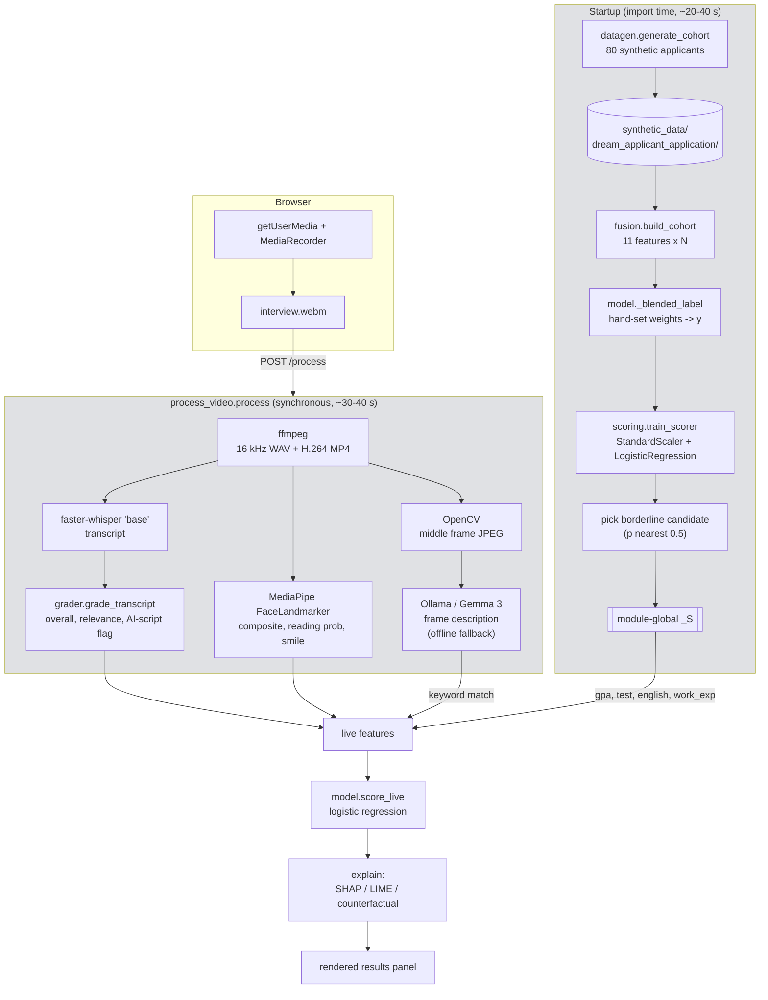

# FAIR-VID live demo — architecture

A single-process Flask app that scores a university applicant by fusing a
pre-loaded academic record with a live-recorded video interview, then explains the
verdict with SHAP, LIME and a counterfactual.

## Components

| Layer | Module | Responsibility |
| --- | --- | --- |
| Web | `webapp/app.py` | Flask routes, inline HTML/CSS/JS, result rendering |
| Orchestration | `webapp/process_video.py` | Runs the six perception stages on one recording, per-stage error capture |
| Decision | `webapp/model.py` | Trains the scorer at startup, holds the pre-loaded candidate, fuses live + record features |
| Perception | `pipeline/behaviour_video.py`, `pipeline/vlm.py`, `pipeline/grader.py` | MediaPipe behaviour metrics, Ollama/Gemma frame description, heuristic transcript grade |
| Fusion & model | `pipeline/fusion.py`, `pipeline/scoring.py`, `pipeline/explain.py` | Late fusion into an 11-feature row, logistic regression, SHAP/LIME/counterfactual |
| Synthetic data | `datagen/*` | Generates the training cohort: records, diploma/transcript PNGs, transcripts, behaviour JSON, frame descriptions |
| Config | `config.py` | Paths, folder naming shared with the Colab notebooks, protected attributes |

## Data flow



## Request lifecycle

```mermaid
sequenceDiagram
    participant B as Browser
    participant F as Flask (single worker)
    participant P as Perception stages
    participant M as Scorer

    B->>F: GET / (candidate + questions)
    B->>B: record webcam
    B->>F: POST /process (webm blob)
    F->>F: save to /tmp/fairvid_runs/<ms>/
    F->>P: ffmpeg, Whisper, OpenCV, Ollama, MediaPipe, grader
    Note over F,P: blocking; no progress, no concurrency
    P-->>F: transcript, frame, behaviour, grade
    F->>M: score_live(record + live features)
    M-->>F: probability, SHAP, counterfactual
    F-->>B: HTML fragment
```

## Observations

**Data location mismatch.** `config.Paths.base_dir` is `<repo>/synthetic_data`, but the
committed cohort lives in `data/synthetic_data`. On first run `model.init()` sees no
cohort and regenerates all 80 applicants, so the 1,125 committed files are never read.

**The label is circular.** `build_cohort` reads the merit-based `admit` label, then
`model.init()` overwrites it with `_blended_label`, a hand-written weighted sum of the
same z-scored features. Logistic regression then recovers those weights, so the reported
accuracy/AUC is close to tautological and the verdict is effectively hand-tuned.

**The "FAIR" half is missing.** `pipeline/__init__.py` documents a `fairness` module that
does not exist. The ingredients are there — `records.py` injects a regional test-score gap,
`scoring.train_scorer` accepts `drop_features` — but nothing computes the disparate impact
ratio or applies mitigation, which is section 5 of the thesis formulation.

**Startup work is done at import.** `model.init()` runs at module scope in `app.py`, so
cohort generation and training block the first import, repeat per worker, and the fitted
model is never persisted.

**Synchronous single-process serving.** `app.run()` handles a 30–40 s request inline. The
cached `_WHISPER` model and the `_S` state dict are module globals with no locking, so a
second concurrent recording is unsafe.

**Implicit feature contract.** Feature order is repeated in `fusion.FEATURE_NAMES`,
`model._WEIGHTS` and the `score_live` dict, with no test binding them together; reordering
one silently corrupts the others. `DISTRACTION_KEYWORDS` is duplicated between
`datagen/frames.py` and `pipeline/fusion.py`, and the live path imports it from `datagen`,
coupling scoring to the synthetic-data package.

**Grader self-fulfils.** `LLM_TELL_WORDS` is both what `datagen/answers.py` plants in
"AI-scripted" answers and what the grader detects, so AI-script detection scores well on
synthetic data and is untested against real speech.

**Counterfactuals are unconstrained.** `explain.counterfactual` nudges every feature along
the gradient, including immutable ones (GPA, test score) and ones with hard bounds, so it
can suggest a GPA above 4.0 or a negative smile frequency.

**Smaller items.** `vlm.ollama_available` is dead code and always returns `True`
(`bool(names) or True`); `VLM_MODEL = "gemma3:12b"` puts a colon in a directory name;
`_smiling` returns a malformed tuple when no frames are found; LIME is computed but never
displayed; recorded biometric video accumulates in `/tmp` with no retention policy; and
`/run/<runid>/<name>` does not validate `runid`, so `..` reaches other files in `/tmp`.
There are no tests, no pinned dependency versions, and no `.gitignore`.

## Suggested alternatives

Ordered by payoff relative to effort.

1. **Point `base_dir` at `data/synthetic_data`** (env-overridable, e.g. `FAIRVID_DATA_DIR`)
   and persist the fitted scorer with `joblib`. Startup becomes a load, not a 40 s train.
2. **Move training and processing out of import and out of the request.** For the demo,
   a background thread plus a job dictionary and a `GET /jobs/<id>` poll gives per-stage
   progress in the UI. For anything beyond the demo, RQ or Celery with Redis, and a worker
   process separate from the web process.
3. **Add `pipeline/fairness.py`** with disparate impact ratio, TPR/FPR gaps by `region` and
   `gender`, and one mitigation (proxy removal via `drop_features`, or Fairlearn's
   `ThresholdOptimizer`). Surface a fairness panel in the UI — it is the project's title
   claim and the cheapest way to close the gap with the thesis.
4. **Make the feature schema one object.** A single `FeatureVector` dataclass (or Pydantic
   model) that owns names, order, bounds and mutability, consumed by fusion, training and
   `score_live`. Move `DISTRACTION_KEYWORDS` into `config.py`.
5. **Decide what the label means.** Either train on the merit-based ground truth and accept
   that the interview moves the verdict less, or keep `_blended_label` but label it in the
   UI as a demo weighting rather than a learned decision. Report metrics on a held-out
   split of the non-circular label.
6. **Define a `Grader` protocol** with three implementations: the current heuristic, an
   Ollama/Gemma judge, and a Gemini judge, selected by env var. Same for the VLM stage,
   which already has the shape of this.
7. **Constrain the counterfactual.** Restrict the search to mutable features (interview,
   behaviour, setting), clip to per-feature bounds, and report the top-k diverse options —
   this is what DiCE does, and the library can replace the hand-rolled gradient walk.
8. **Split presentation from logic.** Move the HTML/CSS/JS into `templates/` and `static/`,
   or expose a JSON API and serve a small static front end. FastAPI is a reasonable swap if
   you go the API route, since it gives async handlers and typed responses.
9. **Treat the recordings as sensitive data.** Validate `runid`, delete run directories after
   a short TTL, keep the MediaPipe model in an app cache directory rather than `/tmp`, and
   add a consent notice — the system is high-risk under the EU AI Act framing in the thesis.
10. **Baseline hygiene.** Pin `requirements.txt`, add `.gitignore` (`venv/`, `__pycache__/`,
    `/tmp` artefacts), add unit tests for the grader bands, fusion shape and explanation
    sign conventions, plus one end-to-end smoke test on a short fixture video.
